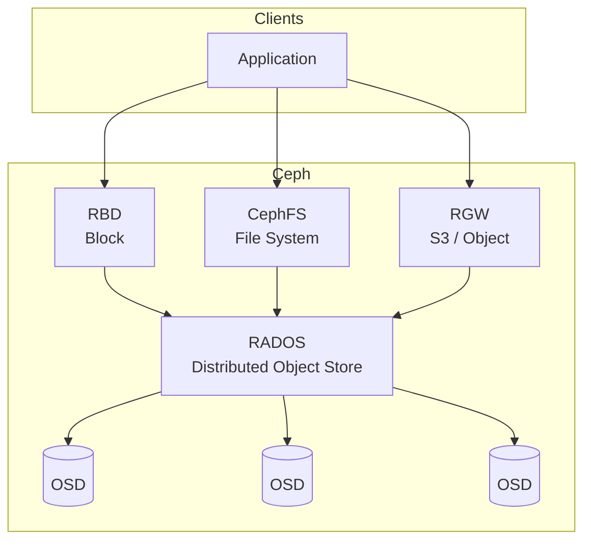

# ceph

- Block Storage (RBD) - RADOS Block Device
- File System (CephFS)
- Object Storage (RGW) - RADOS Gateway

```mermaid
flowchart TB
    subgraph Clients
        A[Application]
    end

    subgraph Ceph["Ceph"]
        RBD[RBD<br/>Block]
        FS[CephFS<br/>File System]
        RGW[RGW<br/>S3 / Object]

        RADOS["RADOS<br/>Distributed Object Store"]

        OSD1[(OSD)]
        OSD2[(OSD)]
        OSD3[(OSD)]
    end

    A --> RBD
    A --> FS
    A --> RGW

    RBD --> RADOS
    FS --> RADOS
    RGW --> RADOS

    RADOS --> OSD1
    RADOS --> OSD2
    RADOS --> OSD3
```

