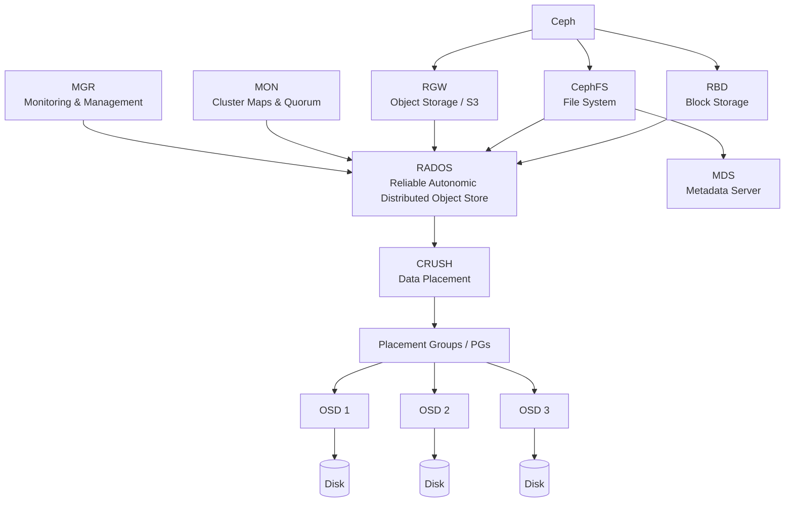
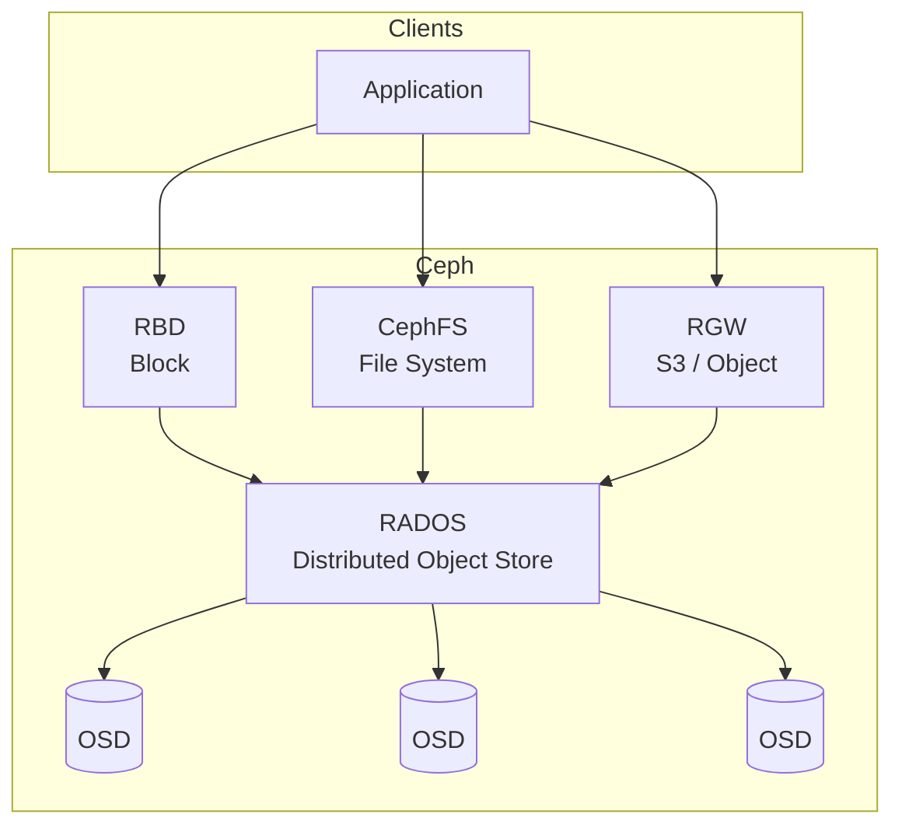
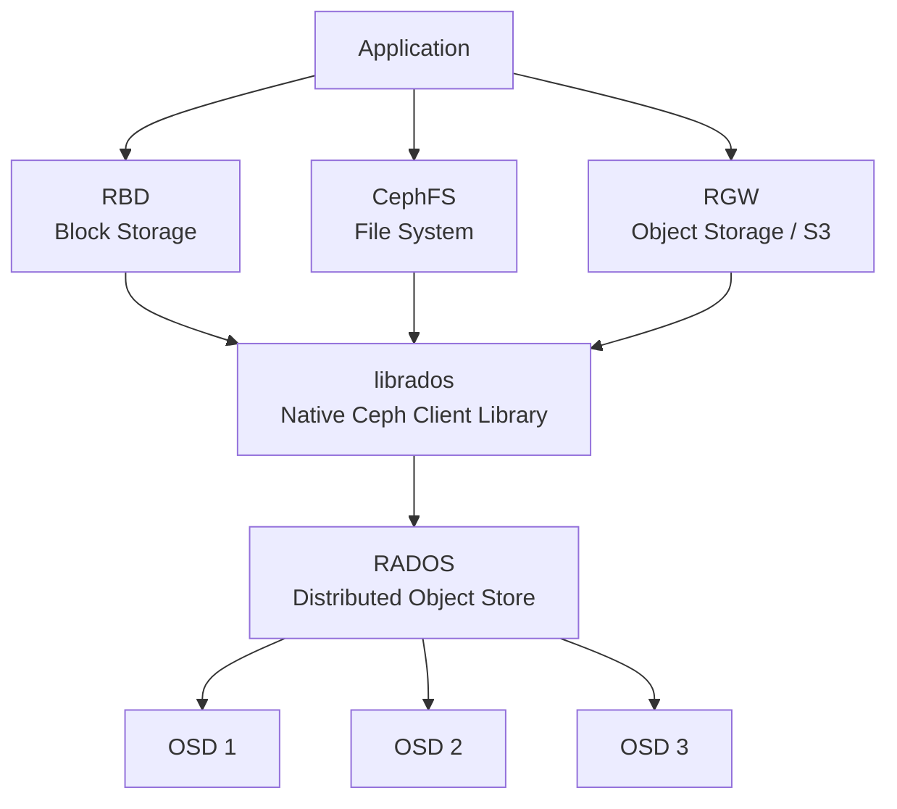
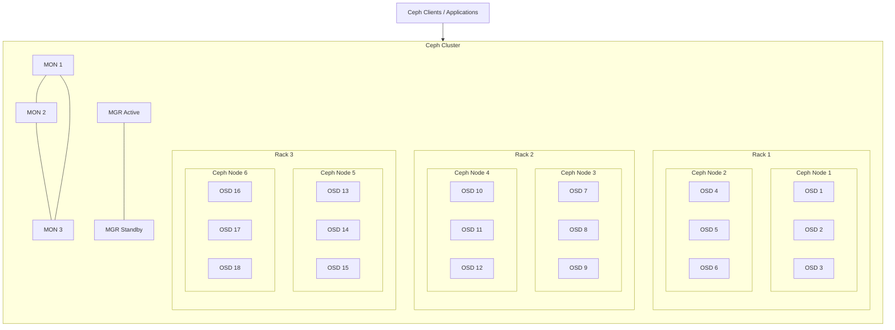
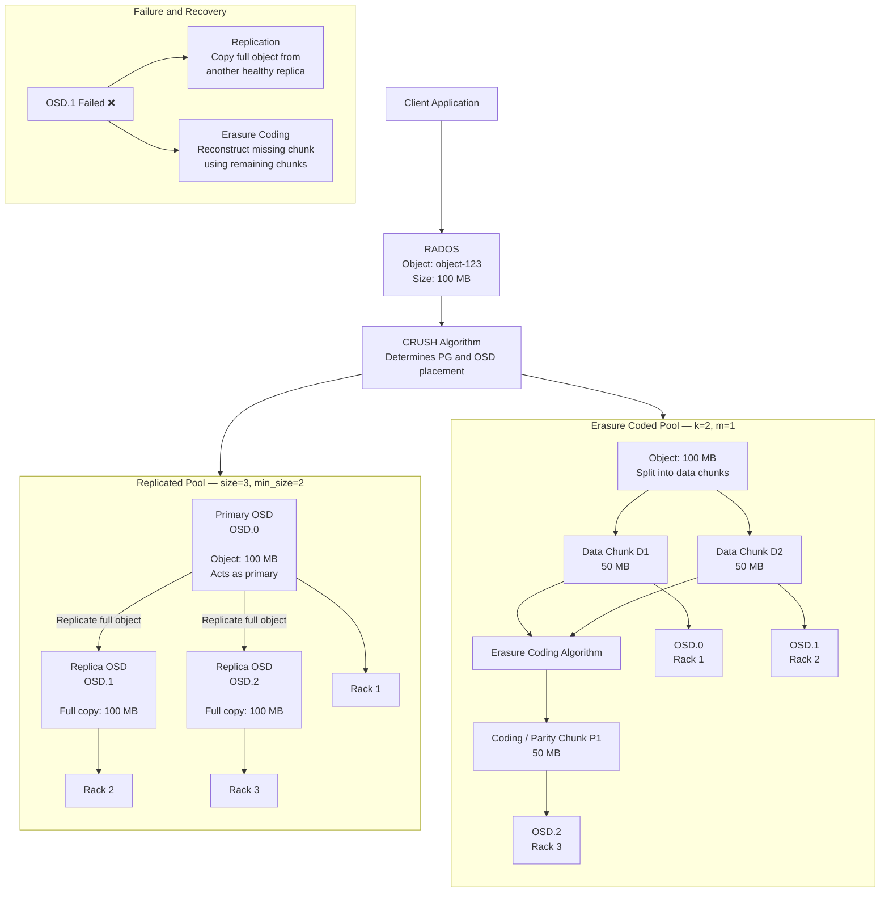

# Architecture

Simple relationship

```mermaid
flowchart TB
    CEPH[Ceph]

    CEPH --> RBD[RBD<br/>Block Storage]
    CEPH --> CEPHFS[CephFS<br/>File System]
    CEPH --> RGW[RGW<br/>Object Storage / S3]

    RBD --> RADOS[RADOS<br/>Reliable Autonomic Distributed Object Store]
    CEPHFS --> RADOS
    RGW --> RADOS

    MON[MON<br/>Cluster Maps & Quorum] --> RADOS
    MGR[MGR<br/>Monitoring & Management] --> RADOS

    RADOS --> CRUSH[CRUSH<br/>Data Placement]

    CRUSH --> PG[Placement Groups / PGs]

    PG --> OSD1[OSD 1]
    PG --> OSD2[OSD 2]
    PG --> OSD3[OSD 3]

    OSD1 --> DISK1[(Disk)]
    OSD2 --> DISK2[(Disk)]
    OSD3 --> DISK3[(Disk)]

    CEPHFS --> MDS[MDS<br/>Metadata Server]
```

---

```mermaid
flowchart TB
    subgraph Clients
        A[Application]
    end

    subgraph Ceph["Ceph"]
        RBD[RBD<br/>Block]
        FS[CephFS<br/>File System]
        RGW[RGW<br/>S3 / Object]

        RADOS["RADOS<br/>Distributed Object Store"]

        OSD1[(OSD)]
        OSD2[(OSD)]
        OSD3[(OSD)]
    end

    A --> RBD
    A --> FS
    A --> RGW

    RBD --> RADOS
    FS --> RADOS
    RGW --> RADOS

    RADOS --> OSD1
    RADOS --> OSD2
    RADOS --> OSD3
```

---

librados = Library for RADOS

```mermaid
flowchart TB
    APP[Application]

    RBD[RBD<br/>Block Storage]
    CEPHFS[CephFS<br/>File System]
    RGW[RGW<br/>Object Storage / S3]

    APP --> RBD
    APP --> CEPHFS
    APP --> RGW

    RBD --> LIBRADOS[librados<br/>Native Ceph Client Library]
    CEPHFS --> LIBRADOS
    RGW --> LIBRADOS

    LIBRADOS --> RADOS[RADOS<br/>Distributed Object Store]

    RADOS --> OSD1[OSD 1]
    RADOS --> OSD2[OSD 2]
    RADOS --> OSD3[OSD 3]
```

---

Ceph cluster distributed across multiple racks

```mermaid
flowchart TB
    CLIENT[Ceph Clients / Applications]

    subgraph CEPH["Ceph Cluster"]
        direction TB

        MON1[MON 1]
        MON2[MON 2]
        MON3[MON 3]

        MGR1[MGR Active]
        MGR2[MGR Standby]

        subgraph RACK1["Rack 1"]
            direction TB

            subgraph NODE1["Ceph Node 1"]
                OSD1[OSD 1]
                OSD2[OSD 2]
                OSD3[OSD 3]
            end

            subgraph NODE2["Ceph Node 2"]
                OSD4[OSD 4]
                OSD5[OSD 5]
                OSD6[OSD 6]
            end
        end

        subgraph RACK2["Rack 2"]
            direction TB

            subgraph NODE3["Ceph Node 3"]
                OSD7[OSD 7]
                OSD8[OSD 8]
                OSD9[OSD 9]
            end

            subgraph NODE4["Ceph Node 4"]
                OSD10[OSD 10]
                OSD11[OSD 11]
                OSD12[OSD 12]
            end
        end

        subgraph RACK3["Rack 3"]
            direction TB

            subgraph NODE5["Ceph Node 5"]
                OSD13[OSD 13]
                OSD14[OSD 14]
                OSD15[OSD 15]
            end

            subgraph NODE6["Ceph Node 6"]
                OSD16[OSD 16]
                OSD17[OSD 17]
                OSD18[OSD 18]
            end
        end
    end

    CLIENT --> CEPH

    MON1 --- MON2
    MON2 --- MON3
    MON1 --- MON3

    MGR1 --- MGR2
```

---

Ceph Replication vs Erasure Coding

```mermaid
flowchart TB
    Client["Client Application"]

    Client --> RADOS["RADOS<br/>Object: object-123<br/>Size: 100 MB"]

    RADOS --> CRUSH["CRUSH Algorithm<br/>Determines PG and OSD placement"]

    %% Replication
    CRUSH --> REP

    subgraph REP["Replicated Pool — size=3, min_size=2"]
        direction TB

        RPrimary["Primary OSD<br/>OSD.0<br/><br/>Object: 100 MB<br/>Acts as primary"]

        RReplica1["Replica OSD<br/>OSD.1<br/><br/>Full copy: 100 MB"]

        RReplica2["Replica OSD<br/>OSD.2<br/><br/>Full copy: 100 MB"]

        RPrimary -->|"Replicate full object"| RReplica1
        RPrimary -->|"Replicate full object"| RReplica2

        RPrimary --> RACK1
        RReplica1 --> RACK2
        RReplica2 --> RACK3

        RACK1["Rack 1"]
        RACK2["Rack 2"]
        RACK3["Rack 3"]
    end

    %% Erasure Coding
    CRUSH --> EC

    subgraph EC["Erasure Coded Pool — k=2, m=1"]
        direction TB

        ECSplit["Object: 100 MB<br/>Split into data chunks"]

        Data1["Data Chunk D1<br/>50 MB"]
        Data2["Data Chunk D2<br/>50 MB"]

        Parity["Coding / Parity Chunk P1<br/>50 MB"]

        ECSplit --> Data1
        ECSplit --> Data2

        Data1 --> Encode["Erasure Coding Algorithm"]
        Data2 --> Encode

        Encode --> Parity

        Data1 --> ECOSD1["OSD.0<br/>Rack 1"]
        Data2 --> ECOSD2["OSD.1<br/>Rack 2"]
        Parity --> ECOSD3["OSD.2<br/>Rack 3"]
    end

    %% Failure Recovery
    subgraph FAILURE["Failure and Recovery"]
        direction LR

        Failed["OSD.1 Failed ❌"]

        RepRecover["Replication<br/>Copy full object from<br/>another healthy replica"]

        ECRecover["Erasure Coding<br/>Reconstruct missing chunk<br/>using remaining chunks"]

        Failed --> RepRecover
        Failed --> ECRecover
    end
```

