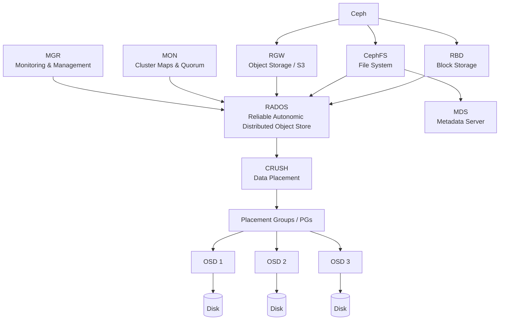
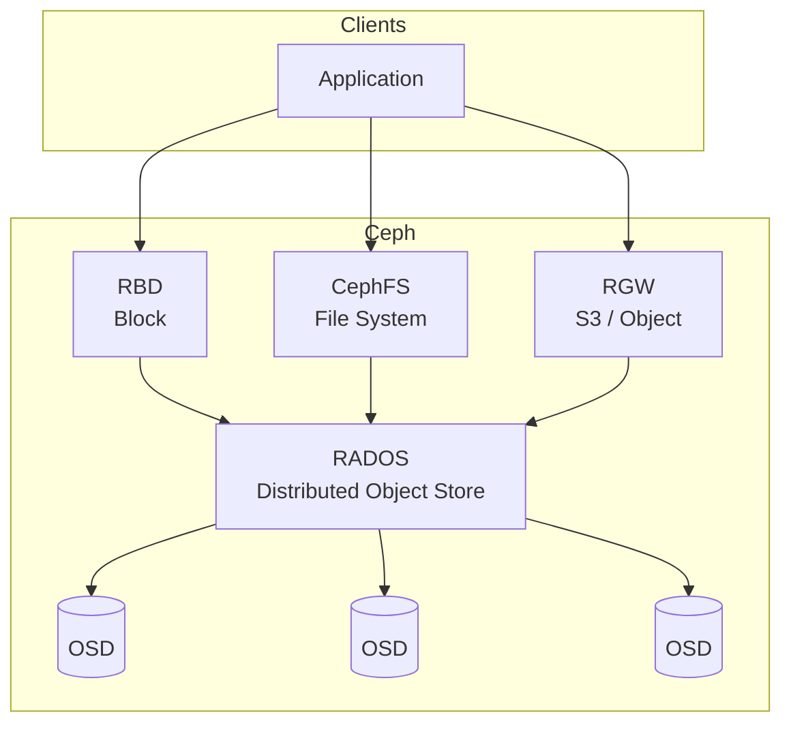
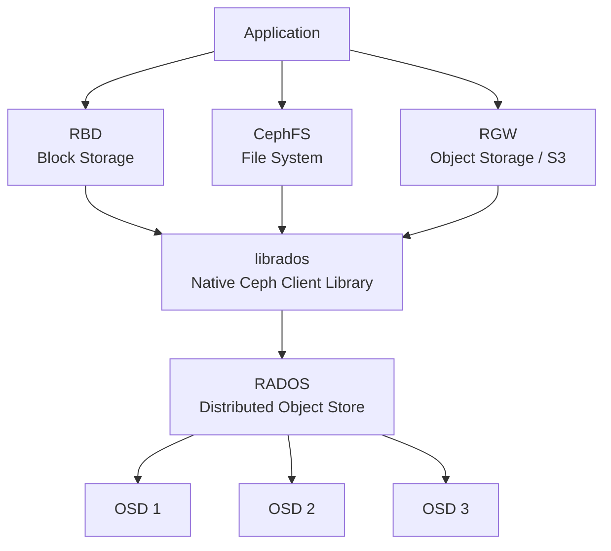

# Architecture

Simple relationship

```mermaid
flowchart TB
    CEPH[Ceph]

    CEPH --> RBD[RBD<br/>Block Storage]
    CEPH --> CEPHFS[CephFS<br/>File System]
    CEPH --> RGW[RGW<br/>Object Storage / S3]

    RBD --> RADOS[RADOS<br/>Reliable Autonomic Distributed Object Store]
    CEPHFS --> RADOS
    RGW --> RADOS

    MON[MON<br/>Cluster Maps & Quorum] --> RADOS
    MGR[MGR<br/>Monitoring & Management] --> RADOS

    RADOS --> CRUSH[CRUSH<br/>Data Placement]

    CRUSH --> PG[Placement Groups / PGs]

    PG --> OSD1[OSD 1]
    PG --> OSD2[OSD 2]
    PG --> OSD3[OSD 3]

    OSD1 --> DISK1[(Disk)]
    OSD2 --> DISK2[(Disk)]
    OSD3 --> DISK3[(Disk)]

    CEPHFS --> MDS[MDS<br/>Metadata Server]
```

---

```mermaid
flowchart TB
    subgraph Clients
        A[Application]
    end

    subgraph Ceph["Ceph"]
        RBD[RBD<br/>Block]
        FS[CephFS<br/>File System]
        RGW[RGW<br/>S3 / Object]

        RADOS["RADOS<br/>Distributed Object Store"]

        OSD1[(OSD)]
        OSD2[(OSD)]
        OSD3[(OSD)]
    end

    A --> RBD
    A --> FS
    A --> RGW

    RBD --> RADOS
    FS --> RADOS
    RGW --> RADOS

    RADOS --> OSD1
    RADOS --> OSD2
    RADOS --> OSD3
```

---

librados = Library for RADOS

```mermaid
flowchart TB
    APP[Application]

    RBD[RBD<br/>Block Storage]
    CEPHFS[CephFS<br/>File System]
    RGW[RGW<br/>Object Storage / S3]

    APP --> RBD
    APP --> CEPHFS
    APP --> RGW

    RBD --> LIBRADOS[librados<br/>Native Ceph Client Library]
    CEPHFS --> LIBRADOS
    RGW --> LIBRADOS

    LIBRADOS --> RADOS[RADOS<br/>Distributed Object Store]

    RADOS --> OSD1[OSD 1]
    RADOS --> OSD2[OSD 2]
    RADOS --> OSD3[OSD 3]
```
