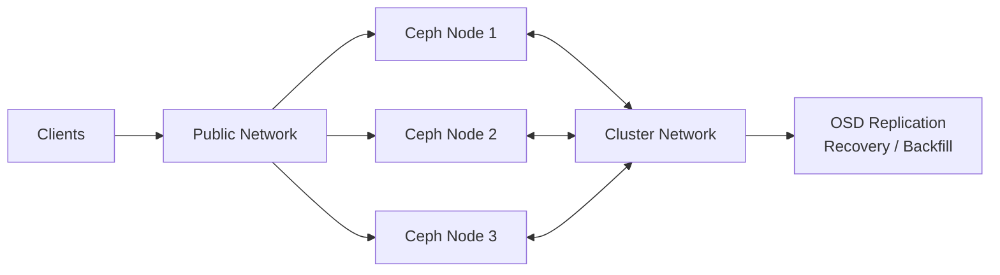

# network

### Ceph Network Design

For Ceph, we should use **2 separate networks**:

* **Public Network** → client/data traffic
* **Cluster Network** → OSD replication, recovery & backfill traffic



**Example:**

```text
Public  : 10.10.10.0/24
Cluster : 10.20.20.0/24
```

This keeps **client traffic separate from heavy Ceph internal traffic**.
